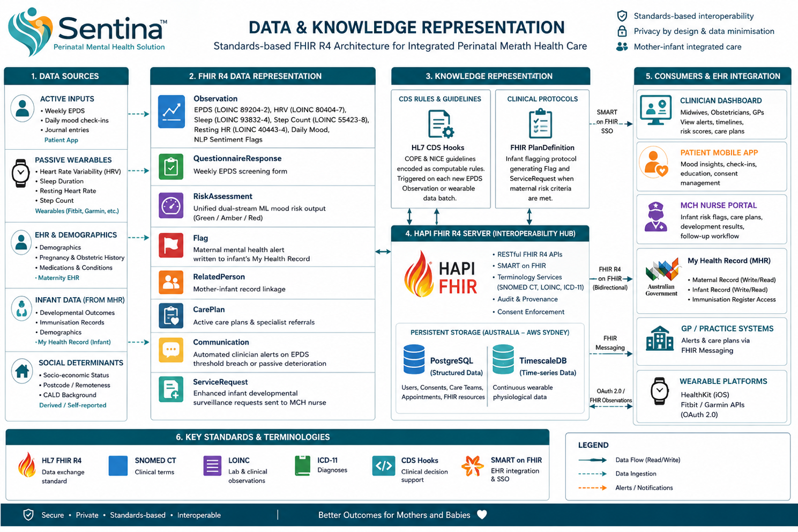
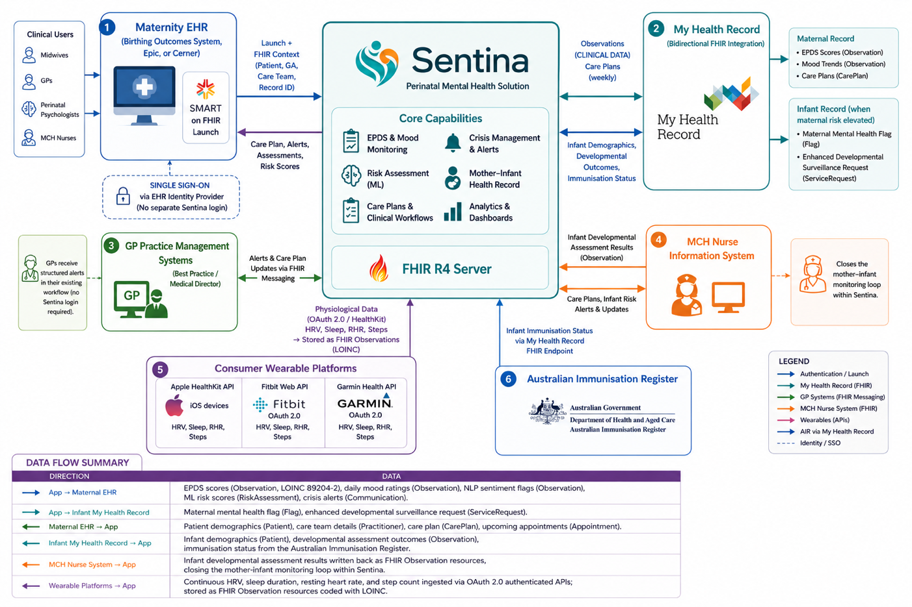
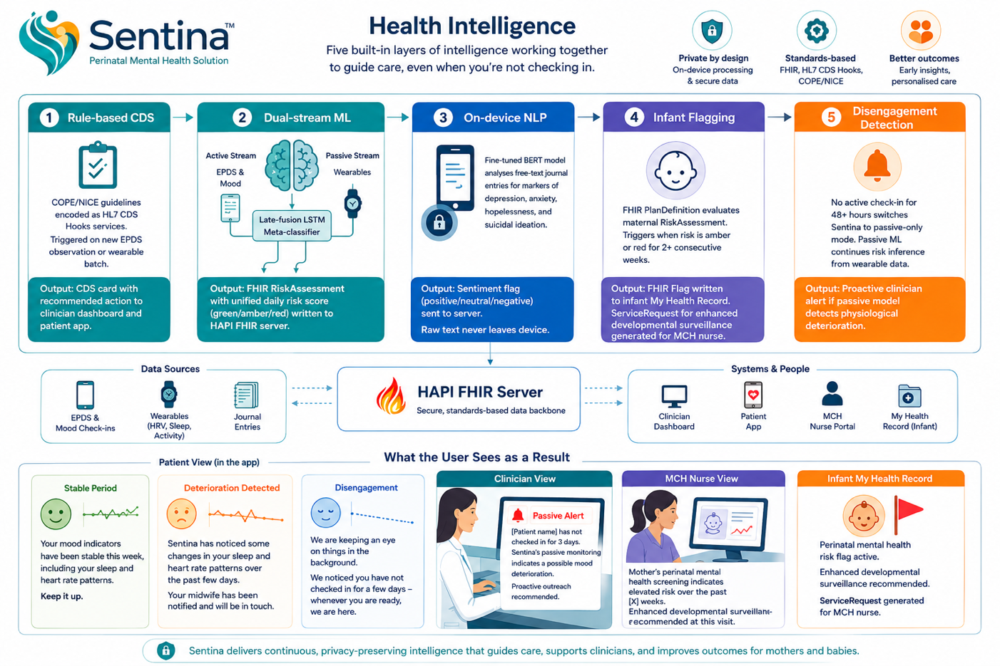

# Sentina — Perinatal Mental Health Platform

Sentina is a perinatal mental health platform that detects early signs of maternal
depression by combining weekly EPDS screening, passive wearable monitoring, and infant
record linkage to coordinate timely care across patients, clinicians, MCH nurses, and
public health teams.

> ISYS90069 Team Project — Tutorial 1, Group 1

---

## Motivation

Perinatal mental health disorders affect about one in five women worldwide and are the
most common complication of childbirth. In Australia, perinatal depression affects 10–15%
of pregnant women and up to 20% of postpartum women, and suicide remains a leading cause
of maternal mortality in the postpartum period. Untreated perinatal depression harms both
mother and infant — poor bonding, delayed cognitive and language development, and
childhood behavioural disorders.

The current standard of care relies on the Edinburgh Postnatal Depression Scale (EPDS)
administered just twice across an 18-month perinatal period — episodic screening that
cannot detect deterioration between appointments, exactly when women are most likely to
fall out of care. Existing digital tools carry a structural blind spot: passive
monitoring platforms lack mental-health capability, and perinatal apps rely on
self-reporting with little passive monitoring or EHR integration.

Sentina closes three gaps:

- **Continuous passive monitoring with mental-health intelligence** — wearable-based HRV,
  sleep, heart rate, and step-count surveillance feeding a dual-stream late-fusion LSTM.
- **Disengagement-resilient screening** — weekly EPDS, daily mood check-ins, and optional
  journals integrated via HL7 CDS Hooks, so risk inference continues from passive data
  even when patients disengage entirely.
- **Mother–infant connectivity** — bidirectional FHIR R4 integration with Australia's
  My Health Record, propagating maternal risk to the infant record and the Maternal and
  Child Health (MCH) nurse workflow.

---

## Architecture

### Data & Knowledge Representation

All data exchanged on Sentina is represented via HL7 FHIR R4 standards to guarantee
semantic interoperability between My Health Record, maternity EHR, and MCH nurse systems.
Clinical terminology uses SNOMED CT and LOINC for physiological and assessment terms, with
ICD-11 for diagnoses. Resource interaction flows run through the HAPI FHIR Server.



### System Integration & Informatics Ecosystem

Sentina integrates with five external systems and accesses the Australian Immunisation
Register through the My Health Record FHIR endpoint. The FHIR R4 Server is the primary
data source across all integrations. Clinical users sign in via SMART on FHIR single
sign-on directly from the maternity EHR, with patient context supplied automatically.
Bidirectional FHIR R4 integration writes EPDS scores, mood summaries, and treatment plans
to the maternal record, and infant risk flags / ServiceRequests to the infant record.



### Health Intelligence

Five intelligence layers deliver computable, evidence-based clinical standards. Output from
every layer is fed to the HAPI FHIR Server and delivered to the clinician dashboard,
patient application, MCH nurse portal, and infant My Health Record.



- **Layer 1 — Rules-based CDS** — COPE/NICE guidelines as CDS Hooks rules. EPDS ≥ 13 raises
  a clinician alert; EPDS Question 10 triggers the safety protocol regardless of score.
- **Layer 2 — Dual-Stream ML** — late-fusion LSTM combining active (EPDS/mood) and passive
  (HRV, sleep, resting heart rate, step count) data into a FHIR RiskAssessment (AUC 0.772).
- **Layer 3 — On-device NLP** — fine-tuned BERT processes journal entries on-device; only
  the sentiment flag is transmitted to the backend.
- **Layer 4 — Infant flagging** — a FHIR PlanDefinition writes a flag and ServiceRequest to
  the infant's My Health Record after two weeks of elevated maternal risk.
- **Layer 5 — Disengagement detection** — passive-only monitoring begins 48 hours after the
  last check-in, alerting clinicians on signs of physiological deterioration.

---

## Technology Stack

| Layer | Technology |
| --- | --- |
| Patient app | React Native (iOS & Android) |
| Clinician Dashboard & MCH Nurse Portal | React.js |
| Backend / business logic, CDS Hooks, alerts | Python FastAPI |
| Clinical data | HAPI FHIR R4 Server |
| Structured application data | PostgreSQL |
| Wearable time-series data | TimescaleDB |
| Machine learning | Dual-stream late-fusion LSTM + on-device BERT |
| Hosting | AWS Sydney (Australian data sovereignty) |

This repository contains the **front-end web bundle** (React + Vite + Tailwind CSS +
shadcn/ui). The original design is available in
[Figma](https://www.figma.com/design/K9jzuyaTs5tZzO3dq7VofX/Sentina).

---

## Privacy & Security

- AES-256 encryption at rest, TLS 1.3 in transit.
- OAuth 2.0 with SMART on FHIR for role-based access via EHR integration (no separate
  login); biometric authentication on the patient app.
- On-device NLP — raw journal entries never leave the device; only a binary sentiment flag
  is sent to the server.
- Data minimisation — only four wearable signals are collected, in line with the Australian
  Privacy Act 1988.
- Sentina's dual-stream ML mood inference qualifies as a **Class IIa SaMD** under the TGA
  framework and requires conformity assessment before clinical deployment.

---

## Running the front-end

```bash
npm install     # install dependencies
npm run dev     # start the development server
```

---

## Links

- **Demo video:** https://youtu.be/mhaybuK_5S8
- **Figma design:** https://www.figma.com/design/K9jzuyaTs5tZzO3dq7VofX/Sentina

---

## Team

| Member | Primary contributions |
| --- | --- |
| Eko Tulus Budi Cahyanto | Data & Knowledge Representation, Data Permanence, Privacy & Security, Computational Platform, Health Intelligence (Figures 1 & 3) |
| Deyulin Chen | Psycho-social literature review, Ethical Review, Patient Usability Assessment, Ethical Evaluation, project branding & report template |
| Xinyue Zhou | Motivation, Medical & Health literature review, Clinical Usability Assessment, Health Impact Experiment (RCT), presentation slides |
| Haitian Chai | Computational Domain literature review, Wireframe Mockups, EHR & Informatics Ecosystem Interaction (Figure 2), MVP front-end implementation, demo video |
